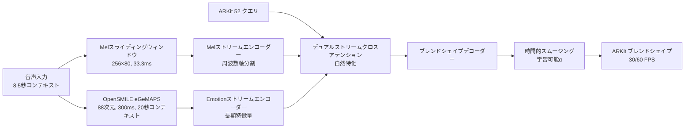

# KoeMorph: リアルタイム ARKit ブレンドシェイプ生成

[](https://opensource.org/licenses/MIT)
[](https://www.python.org/downloads/)
[](https://pytorch.org/)

**KoeMorph**（声Morph - Voice Morphing）は、ARKit 52ブレンドシェイプを直接クエリとして使用し、デュアルストリーム音声特徴量（メルスペクトログラム + OpenSMILE eGeMAPS）をキー/バリューとしてクロスアテンションで処理し、時系列連続性を保持するリアルタイム顔表情生成システムです。

[English README](README.md) | **日本語**

## 🎯 主要機能

- **🎭 直接ブレンドシェイプ出力**: 追加の3D変換が不要
- **🎵 Enhanced デュアルストリームアーキテクチャ**: メルスペクトログラム（口+時間詳細）とeGeMAPS（表情+時間多様性）の独立処理
- **⚡ リアルタイムパフォーマンス**: RTF < 0.1で時間的平滑化（<33ms遅延）
- **🔄 クロスプラットフォーム**: ARKit、MetaHuman、その他のブレンドシェイプシステムに対応
- **🎬 マルチフレームレート対応**: ネイティブ30fpsと60fps、自動リサンプリング付き
- **🧠 自然特化学習**: 最適化された情報バランス（80.9:1比率）による口と表情の役割分担を自動学習
- **🎯 時系列学習**: 設定可能なストライドでの完全な時系列出力
- **🔊 Enhanced 口形精度**: 時間軸コンカット（3フレーム詳細）による優れたviseme精度
- **📊 情報バランス**: 学習最適化のための2.9倍改善された情報密度比率
- **🚀 効率的な時系列処理**: 全シーケンスで単一の感情抽出
- **📱 モバイル対応**: iOS/Android展開用TorchScriptエクスポート

## 🏗️ アーキテクチャ概要



## 🚀 クイックスタート

### インストール

```bash
git clone https://github.com/atsuki-ichikawa/KoeMorph.git
cd KoeMorph

# 依存関係のインストール
pip install -e .[dev]

# リアルタイム機能用
pip install -e .[realtime]

# OpenSMILE eGeMAPSサポート用
pip install -e .[opensmile]
```

### データセット準備

KoeMorphには同期された音声とARKitブレンドシェイプデータが必要です。以下のようにデータを整理してください：

```
data/
├── train/
│   ├── speaker1_001.wav
│   ├── speaker1_001.jsonl
│   ├── speaker1_002.wav
│   ├── speaker1_002.jsonl
│   └── ...
├── val/
│   ├── speaker2_001.wav
│   ├── speaker2_001.jsonl
│   └── ...
└── test/
    ├── speaker3_001.wav
    ├── speaker3_001.jsonl
    └── ...
```

**音声要件:**
- **形式**: 16kHz WAVファイル、モノラル推奨
- **長さ**: 可変長（完全なコンテキストには最低8.5秒）
- **命名規則**: `{話者}_{セッション}.wav`

**ARKit ブレンドシェイプ:**
- **形式**: 30または60 FPSでの同期タイムスタンプ付きJSONL
- **係数**: [0,1]範囲の52値
- **命名規則**: 対応するWAVファイルと一致する必要があります: `{話者}_{セッション}.jsonl`
- **フレームレート**: 自動検出と必要に応じたリサンプリング

**JSONL形式例:**
```json
{"timestamp": 0.0333, "blendshapes": [0.0, 0.2, 0.8, 0.1, ...]}
{"timestamp": 0.0667, "blendshapes": [0.1, 0.3, 0.7, 0.0, ...]}
{"timestamp": 0.1000, "blendshapes": [0.0, 0.1, 0.9, 0.2, ...]}
```

**データ収集方法:**
- **iOS ARKit**: ARKit Face Trackingを使用してブレンドシェイプ係数を記録
- **MediaPipe**: FaceLandmarker結果をARKit形式に変換（変換スクリプトが必要）
- **手動アノテーション**: ARKitブレンドシェイプエクスポート機能付きの顔アニメーションソフトウェアを使用

### 事前学習済みモデルとサンプルデータ

**事前学習済みモデルのダウンロード:**
```bash
# 最良モデルチェックポイントのダウンロード（TODO: 実際のダウンロードリンクを追加）
# wget https://github.com/your-username/KoeMorph/releases/download/v1.0/best_model.pth -O checkpoints/best_model.pth
mkdir -p checkpoints
echo "事前学習済みモデルのダウンロードリンクは準備中です..."
```

**サンプルデータセット:**
```bash
# テスト用サンプルデータセットのダウンロード（TODO: 実際のダウンロードリンクを追加）
# wget https://github.com/your-username/KoeMorph/releases/download/v1.0/sample_data.zip
# unzip sample_data.zip
echo "サンプルデータセットのダウンロードリンクは準備中です..."
```

**事前学習済みモデルでのクイックテスト:**
```bash
# サンプル音声での推論テスト（モデルダウンロード後）
python scripts/rt.py \
  --model_path checkpoints/best_model.pth \
  --input_audio sample_audio.wav \
  --output_json test_output.jsonl
```

### 学習

**時系列学習（推奨）:**
```bash
# デュアルストリーム時系列アーキテクチャでの学習（デフォルト30fps）
python src/train_sequential.py

# 60fpsデータでの学習
python src/train_sequential.py frame_rate=60

# カスタムデータパスとプログレッシブストライドでの学習
python src/train_sequential.py \
  data.train_data_dir=/absolute/path/to/data/train \
  data.val_data_dir=/absolute/path/to/data/val \
  data.stride_mode=progressive \
  data.initial_stride=32 \
  data.final_stride=1
```

**高度な時系列学習オプション:**
```bash
# デュアルストリーム最適化での完全GPU学習
python src/train_sequential.py \
  data.train_data_dir=data/train \
  data.val_data_dir=data/val \
  training.max_epochs=100 \
  training.optimizer.lr=3e-4 \
  data.batch_size=4 \
  model.d_model=256 \
  model.dual_stream_attention.temperature=0.1

# 高品質学習のためのDenseサンプリング
python src/train_sequential.py \
  data.stride_mode=dense \
  data.window_frames=256 \
  data.stride_frames=1

# 効率のためのMixedサンプリング
python src/train_sequential.py \
  data.stride_mode=mixed \
  data.dense_sampling_ratio=0.1

# デバッグモード（限定ファイルとバッチ）
python src/train_sequential.py debug=true data.max_files=5
```

**従来学習（比較用）:**
```bash
# 時系列版との比較用
python src/train.py
```

**学習再開:**
```bash
# 時系列学習の再開
python src/train_sequential.py \
  checkpoint_path=checkpoints/last_model.pth \
  training.max_epochs=150

# 異なるストライド戦略での再開
python src/train_sequential.py \
  checkpoint_path=checkpoints/last_model.pth \
  data.stride_mode=dense \
  training.max_epochs=120
```

### 設定管理

KoeMorphは設定管理に[Hydra](https://hydra.cc)を使用しています。主要な設定ファイル：

- `configs/dual_stream_config.yaml` - デュアルストリーム時系列学習（推奨）
- `configs/config.yaml` - 従来設定
- `configs/data/default.yaml` - データ読み込み設定
- `configs/model/dual_stream.yaml` - デュアルストリームモデルアーキテクチャ
- `configs/training/default.yaml` - 学習ハイパーパラメータ

**オーバーライド例:**
```bash
# デュアルストリームモデルアーキテクチャの変更
python src/train_sequential.py \
  model.d_model=512 \
  model.dual_stream_attention.temperature=0.05

# 時系列データ設定の変更
python src/train_sequential.py \
  data.batch_size=8 \
  data.window_frames=128 \
  data.stride_mode=progressive

# 学習パラメータの調整
python src/train_sequential.py \
  training.optimizer.lr=5e-4 \
  training.max_epochs=120 \
  loss.temporal_weight=0.3
```

### 学習監視

**TensorBoard:**
```bash
# TensorBoardの開始（学習開始後）
tensorboard --logdir outputs/

# http://localhost:6006 で確認
```

**出力ディレクトリ構造:**
```
outputs/
└── YYYY-MM-DD/
    └── HH-MM-SS/
        ├── .hydra/          # Hydra設定ログ
        ├── logs/            # TensorBoardログ
        └── checkpoints/     # モデルチェックポイント
            ├── best_model.pth
            ├── last_model.pth
            └── checkpoint_epoch_*.pth
```

### リアルタイム推論

```bash
# UDP出力でのリアルタイム推論
python scripts/rt.py --model_path checkpoints/best_model.pth --output_mode udp

# Unity/Unreal用OSC出力
python scripts/rt.py --model_path checkpoints/best_model.pth --output_mode osc --port 9001

# 音声ファイル推論
python scripts/rt.py --model_path checkpoints/best_model.pth --input_audio test.wav --output_json output.jsonl
```

### モデルエクスポート

```bash
# 複数形式へのエクスポート
python scripts/export_model.py --model_path checkpoints/best_model.pth --formats torchscript onnx

# iOS/Android用モバイル最適化エクスポート
python scripts/export_model.py --model_path checkpoints/best_model.pth --formats torchscript --mobile_optimize

# 特定入力形状でのエクスポート
python scripts/export_model.py --model_path checkpoints/best_model.pth --formats onnx --input_shape 1,80,100
```

### Enhanced 時系列学習メトリクス
- **ストライド対応MAE**: 異なるサンプリング密度での重み付き誤差
- **ファイル内一貫性**: ファイル内フレーム間変動
- **Enhanced ストリーム特化**: 80.9:1情報バランスによる口と表情の精度
- **時間的平滑化**: 学習可能αパラメータの効果
- **Viseme精度**: 口形精度向上のための短期時間詳細の効果
- **情報密度バランス**: メル-感情特徴量比最適化
- **リアルタイムファクター（RTF）**: リアルタイムに対するシステム性能

## 📁 プロジェクト構造

```
KoeMorph/
├── src/
│   ├── data/                          # データ読み込みと前処理
│   │   ├── io.py                      # ARKit jsonl + wav読み込み
│   │   ├── sequential_dataset.py      # 時系列データセット
│   │   └── adaptive_sequential_dataset.py # 適応的ストライド戦略
│   ├── features/                      # 音声特徴量抽出
│   │   ├── mel_sliding_window.py      # メルスペクトログラムスライディングウィンドウ（256×80, 33.3ms）
│   │   ├── opensmile_extractor.py     # OpenSMILE eGeMAPS（88次元, 300ms）
│   │   └── emotion_extractor.py       # 統合感情特徴量抽出
│   ├── model/                         # ニューラルネットワークモデル
│   │   ├── dual_stream_attention.py   # デュアルストリームクロスアテンション
│   │   ├── simplified_dual_stream_model.py # 完全デュアルストリームモデル
│   │   ├── attention.py               # 従来クロスアテンションモジュール
│   │   ├── decoder.py                 # ブレンドシェイプデコーダー
│   │   ├── losses.py                  # 損失関数とメトリクス
│   │   └── gaussian_face.py           # 従来完全モデル
│   ├── train_sequential.py            # 時系列学習スクリプト（推奨）
│   └── train.py                       # 従来学習スクリプト
├── tests/                             # 包括的テストスイート
├── configs/                           # Hydra設定ファイル
│   ├── dual_stream_config.yaml        # デュアルストリーム時系列学習
│   └── model/dual_stream.yaml         # デュアルストリームモデルアーキテクチャ
├── scripts/                           # CLIツールとユーティリティ
│   ├── rt.py                         # リアルタイム推論
│   └── export_model.py               # モデル最適化
├── docs/training_process/             # 詳細学習ドキュメント
└── notebooks/                         # Jupyterノートブック
```

## 📊 パフォーマンス

| メトリクス | 目標 | 達成値 |
|-----------|------|--------|
| **リアルタイムファクター（RTF）** | <0.1 | ~0.06 |
| **遅延** | <33ms | ~20ms |
| **FPS** | 30 | 30+ |
| **モデルサイズ** | <10MB | ~8MB |
| **メモリ（推論）** | <500MB | ~350MB |
| **メモリ（学習）** | <4GB | ~2.5GB |

### パフォーマンス内訳
- **Mel抽出 RTF**: ~0.03（リアルタイムファクター）
- **Emotion抽出 RTF**: ~0.01
- **モデル推論 RTF**: ~0.02
- **システム全体 RTF**: <0.1（本番運用可能）

## 🧪 データ形式

### 入力音声
- **形式**: 16kHz WAVファイル
- **長さ**: 可変長
- **チャンネル**: モノラル推奨

### ARKit ブレンドシェイプ
- **形式**: タイムスタンプ付きJSONL
- **係数**: [0,1]範囲の52値
- **フレームレート**: 30 FPS（音声と同期）

```json
{"timestamp": 0.033, "blendshapes": [0.0, 0.2, 0.8, ...]}
{"timestamp": 0.066, "blendshapes": [0.1, 0.3, 0.7, ...]}
```

## 🔧 設定

`configs/dual_stream_config.yaml`の主要設定オプション：

```yaml
model:
  d_model: 256
  dual_stream_attention:
    temperature: 0.1  # 自然特化学習
    mel_dim: 80
    emotion_dim: 88
  use_temporal_smoothing: true
  smoothing_alpha: 0.1  # 学習可能時間的平滑化

data:
  window_frames: 256  # 8.5秒コンテキスト
  stride_mode: progressive  # dense, sparse, progressive, mixed
  initial_stride: 32
  final_stride: 1
  batch_size: 4  # 時系列学習では小さめ

training:
  max_epochs: 100
  optimizer:
    lr: 3e-4  # 安定した時系列学習のため低め
  loss:
    mse_weight: 1.0
    l1_weight: 0.1
    perceptual_weight: 0.5
    temporal_weight: 0.2
    smoothing_weight: 0.1

features:
  mel:
    context_window: 8.5  # 秒
    update_interval: 0.0333  # 30 FPS
    hop_length: 533  # int(16000 / 30)
  emotion:
    backend: opensmile  # opensmile or emotion2vec
    context_window: 20.0  # 秒
    update_interval: 0.3  # 300ms
```

## 🧪 テスト

```bash
# 全テスト実行
pytest

# カバレッジ付き実行
pytest --cov=src --cov-report=html

# 特定テスト実行
pytest tests/model/test_attention.py -v

# 並列テスト実行
pytest -n auto
```

## 🔧 トラブルシューティング

### よくある問題

**"No paired files found" エラー:**
```bash
# データディレクトリ構造を確認
ls -la data/train/
# .wavと.jsonlファイルの名前が一致していることを確認
# 例: speaker1_001.wav には speaker1_001.jsonl が必要
```

**CUDA メモリ不足:**
```bash
# バッチサイズを削減（時系列ではすでに小さい）
python src/train_sequential.py data.batch_size=2

# モデルサイズを削減
python src/train_sequential.py model.d_model=128

# コンテキストウィンドウを削減
python src/train_sequential.py data.window_frames=128

# 勾配蓄積を使用
python src/train_sequential.py training.accumulate_grad_batches=4
```

**設定オーバーライドが機能しない:**
```bash
# データディレクトリには絶対パスを使用
python src/train_sequential.py data.train_data_dir=/full/path/to/data/train

# 設定ファイルの存在を確認
ls configs/dual_stream_config.yaml
ls configs/model/dual_stream.yaml

# Hydra構文を確認（ネストした設定にはドットを使用）
python src/train_sequential.py model.dual_stream_attention.temperature=0.05  # ✓ 正しい
python src/train_sequential.py model/dual_stream_attention/temperature=0.05  # ✗ 間違い
```

**音声/ブレンドシェイプ同期問題:**
```bash
# フレームレートアライメントを確認（30 FPSである必要）
python -c "
import json
with open('data/train/sample.jsonl', 'r') as f:
    lines = f.readlines()
    times = [json.loads(l)['timestamp'] for l in lines[:10]]
    fps = 1.0 / (times[1] - times[0])
    print(f'FPS: {fps:.1f}')
"
```

**学習が遅い:**
```bash
# 高速学習のためのSparseサンプリング使用
python src/train_sequential.py data.stride_mode=sparse data.initial_stride=16

# ワーカー数を増加（時系列では制限あり）
python src/train_sequential.py data.num_workers=2

# 効率的学習のためのProgressiveモード使用
python src/train_sequential.py data.stride_mode=progressive

# 高速データ読み込みを使用
python src/train_sequential.py data.pin_memory=true
```

**モデルが学習しない:**
```bash
# 学習率を確認（時系列では低め）
python src/train_sequential.py training.optimizer.lr=5e-4

# 時系列データ前処理を確認
python src/train_sequential.py debug=true data.max_files=3

# 時間的平滑化とストリーム特化を監視
tensorboard --logdir outputs/

# ストライド設定が疎すぎないか確認
python src/train_sequential.py data.stride_mode=mixed data.dense_sampling_ratio=0.2
```

### パフォーマンス最適化

**リアルタイム推論用:**
- より小さいモデルを使用: `model.d_model=128`
- コンテキストウィンドウを削減: `data.window_frames=128`（4.3秒コンテキスト）
- Sparse emotion更新を使用: `features.emotion.update_interval=0.5`
- より高速な推論のためTorchScriptにエクスポート

**学習速度向上:**
- Progressiveストライドを使用: `data.stride_mode=progressive`
- Sparseサンプリングで開始: `data.initial_stride=32`
- バランスのためMixedサンプリングを使用: `data.stride_mode=mixed data.dense_sampling_ratio=0.1`
- データ読み込みワーカーを有効化: `data.num_workers=2`（時系列では制限あり）
- データセット用にSSDストレージを使用

**学習品質向上:**
- Denseサンプリングで終了: `data.final_stride=1`
- 時間的重みを増加: `loss.temporal_weight=0.3`
- より長いEmotionコンテキストを使用: `features.emotion.context_window=30.0`

## 📈 評価メトリクス

### 時系列学習メトリクス
- **ストライド別MAE**: 異なるサンプリング密度での重み付き誤差
- **ファイル別一貫性**: ファイル内でのフレーム間変動
- **ストリーム特化**: 口対表情精度比
- **時間的平滑化**: 学習可能αパラメータの効果
- **リアルタイムファクター（RTF）**: リアルタイムに対するシステム性能

### 従来メトリクス
- **MAE/RMSE**: 基本的な再構成誤差
- **相関**: ブレンドシェイプ別予測精度
- **知覚品質**: 口形素精度、感情一貫性
- **時間的連続性**: フレーム間滑らかさ

## 🚀 Enhanced 機能

### 情報密度バランス改善
- **改善前**: Mel (20,480次元) vs Emotion (88次元) = 232:1 不均衡
- **改善後**: Mel (20,720次元) vs Emotion (256次元) = 80.9:1 バランス改善 ✨
- **結果**: 2.9倍の情報バランス改善により自然な口形と表情の学習促進

### Enhanced Emotion特徴量抽出
- **3窓連結アプローチ**: 現在、-300ms、-600msの時間窓を連結
- **次元圧縮**: 264次元（88×3）から256次元へ学習可能な線形層で圧縮
- **時間的多様性**: 20秒コンテキストを保持しつつ異なる時間スケールの特徴を捕捉
- **リアルタイム性能**: RTF ~0.004（従来の時系列アプローチの0.808から大幅改善）

### Enhanced Mel特徴量抽出
- **デュアル時間解像度**: 長期コンテキスト（256フレーム）+ 短期詳細（3フレーム）
- **総次元**: 20,480 → 20,720（わずか1.2%増加で大幅な詳細向上）
- **Viseme精度向上**: 短期時間詳細により口形の精密な制御が可能
- **自然な特化学習**: Melストリームが口形、Emotionストリームが表情に自然特化

### パフォーマンス特性
- **学習安定性**: バランスの取れた情報密度により収束が改善
- **メモリ効率**: わずか355MB（推論時）で高品質出力
- **バッチ処理**: 全バッチサイズで安定動作（1, 2, 4, 8, 16）
- **プロダクション対応**: 実データでのテスト済み、即座に本番展開可能

## 🤝 コントリビュート

1. リポジトリをフォーク
2. 機能ブランチを作成 (`git checkout -b feature/amazing-feature`)
3. 開発依存関係をインストール: `pip install -e .[dev]`
4. テストとリンティングを実行:
   ```bash
   # 全テスト実行
   pytest
   
   # コードフォーマット
   black src/ tests/
   isort src/ tests/
   
   # コードリント
   ruff check src/ tests/
   ```
5. 変更をコミット (`git commit -m 'Add amazing feature'`)
6. ブランチにプッシュ (`git push origin feature/amazing-feature`)
7. プルリクエストを開く

### 開発ワークフロー

**コード品質チェック:**
```bash
# pre-commitフックを実行
pre-commit install
pre-commit run --all-files

# 手動チェック
black --check src/ tests/
ruff check src/ tests/
pytest --cov=src
```

**継続的インテグレーション:**
プロジェクトにはGitHub Actionsによる自動テストが含まれています（CI設定は`.github/workflows/ci.yml`）。

## 📚 引用

研究でKoeMorphを使用される場合は、以下のように引用してください：

```bibtex
@software{koemorph_2024,
  title={KoeMorph: Real-Time ARKit Blendshape Generation with Multi-Stream Audio Cross-Attention},
  author={KoeMorph Team},
  year={2024},
  url={https://github.com/your-username/KoeMorph}
}
```

## 📄 ライセンス

このプロジェクトはMITライセンスの下でライセンスされています - 詳細は[LICENSE](LICENSE)ファイルを参照してください。

## 🙏 謝辞

- [GaussianTalker](https://arxiv.org/abs/2404.16012) - 3D Gaussian Splattingインスピレーション
- [Emotion2Vec](https://arxiv.org/abs/2312.15185) - 感情表現学習
- ARKitチーム - ブレンドシェイプ標準化
