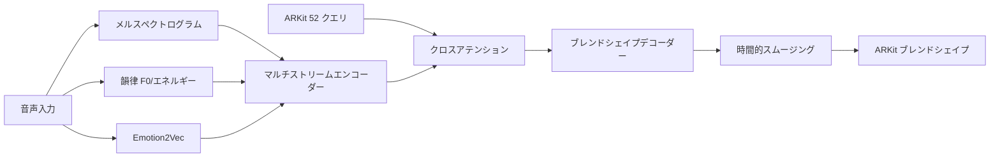

# KoeMorph: リアルタイム ARKit ブレンドシェイプ生成

[](https://opensource.org/licenses/MIT)
[](https://www.python.org/downloads/)
[](https://pytorch.org/)

**KoeMorph**（声Morph - Voice Morphing）は、ARKit 52ブレンドシェイプを直接クエリとして使用し、マルチストリーム音声特徴量（log-Mel、韻律、emotion2vec）をキー/バリューとしてクロスアテンションで処理する、リアルタイム顔表情生成システムです。

[English README](README.md) | **日本語**

## 🎯 主要機能

- **🎭 直接ブレンドシェイプ出力**: 追加の3D変換が不要
- **🎵 マルチストリーム音声**: log-Mel、韻律、感情特徴量を組み合わせ
- **⚡ リアルタイムパフォーマンス**: 低遅延推論に最適化（<33ms）
- **🔄 クロスプラットフォーム**: ARKit、MetaHuman、その他のブレンドシェイプシステムに対応
- **🧠 アテンション機構**: 音声-視覚アライメントにクロスアテンションを使用
- **📱 モバイル対応**: iOS/Android展開用TorchScriptエクスポート

## 🏗️ アーキテクチャ概要



## 🚀 クイックスタート

### インストール

```bash
git clone https://github.com/atsuki-ichikawa/KoeMorph.git
cd KoeMorph

# 依存関係のインストール
pip install -e .[dev]

# リアルタイム機能用
pip install -e .[realtime]

# emotion2vecサポート用
pip install -e .[emotion2vec]
```

### データセット準備

KoeMorphには同期された音声とARKitブレンドシェイプデータが必要です。以下のようにデータを整理してください：

```
data/
├── train/
│   ├── speaker1_001.wav
│   ├── speaker1_001.jsonl
│   ├── speaker1_002.wav
│   ├── speaker1_002.jsonl
│   └── ...
├── val/
│   ├── speaker2_001.wav
│   ├── speaker2_001.jsonl
│   └── ...
└── test/
    ├── speaker3_001.wav
    ├── speaker3_001.jsonl
    └── ...
```

**音声要件:**
- **形式**: 16kHz WAVファイル、モノラル推奨
- **長さ**: 可変長（デフォルトで最大10秒）
- **命名規則**: `{話者}_{セッション}.wav`

**ARKit ブレンドシェイプ:**
- **形式**: 30 FPSでの同期タイムスタンプ付きJSONL
- **係数**: [0,1]範囲の52値
- **命名規則**: 対応するWAVファイルと一致する必要があります: `{話者}_{セッション}.jsonl`

**JSONL形式例:**
```json
{"timestamp": 0.0333, "blendshapes": [0.0, 0.2, 0.8, 0.1, ...]}
{"timestamp": 0.0667, "blendshapes": [0.1, 0.3, 0.7, 0.0, ...]}
{"timestamp": 0.1000, "blendshapes": [0.0, 0.1, 0.9, 0.2, ...]}
```

**データ収集方法:**
- **iOS ARKit**: ARKit Face Trackingを使用してブレンドシェイプ係数を記録
- **MediaPipe**: FaceLandmarker結果をARKit形式に変換（変換スクリプトが必要）
- **手動アノテーション**: ARKitブレンドシェイプエクスポート機能付きの顔アニメーションソフトウェアを使用

### 事前学習済みモデルとサンプルデータ

**事前学習済みモデルのダウンロード:**
```bash
# 最良モデルチェックポイントのダウンロード（TODO: 実際のダウンロードリンクを追加）
# wget https://github.com/your-username/KoeMorph/releases/download/v1.0/best_model.pth -O checkpoints/best_model.pth
mkdir -p checkpoints
echo "事前学習済みモデルのダウンロードリンクは準備中です..."
```

**サンプルデータセット:**
```bash
# テスト用サンプルデータセットのダウンロード（TODO: 実際のダウンロードリンクを追加）
# wget https://github.com/your-username/KoeMorph/releases/download/v1.0/sample_data.zip
# unzip sample_data.zip
echo "サンプルデータセットのダウンロードリンクは準備中です..."
```

**事前学習済みモデルでのクイックテスト:**
```bash
# サンプル音声での推論テスト（モデルダウンロード後）
python scripts/rt.py \
  --model_path checkpoints/best_model.pth \
  --input_audio sample_audio.wav \
  --output_json test_output.jsonl
```

### 学習

**基本学習:**
```bash
# デフォルト設定での学習
python src/train.py

# カスタムデータパスでの学習
python src/train.py \
  data.train_data_dir=/absolute/path/to/data/train \
  data.val_data_dir=/absolute/path/to/data/val
```

**高度な学習オプション:**
```bash
# カスタムパラメータでの完全GPU学習
python src/train.py \
  data.train_data_dir=data/train \
  data.val_data_dir=data/val \
  training.max_epochs=120 \
  training.optimizer.lr=5e-4 \
  data.batch_size=32 \
  model.d_model=384 \
  model.attention.num_heads=12

# 特定デバイスでの学習
python src/train.py device=cuda:1

# デバッグモード（テスト用の限定バッチ）
python src/train.py debug=true
```

**学習再開:**
```bash
python src/train.py \
  checkpoint_path=checkpoints/last_model.pth \
  training.max_epochs=200
```

### 設定管理

KoeMorphは設定管理に[Hydra](https://hydra.cc)を使用しています。主要な設定ファイル：

- `configs/config.yaml` - メイン設定
- `configs/data/default.yaml` - データ読み込み設定
- `configs/model/default.yaml` - モデルアーキテクチャ
- `configs/training/default.yaml` - 学習ハイパーパラメータ

**オーバーライド例:**
```bash
# モデルアーキテクチャの変更
python src/train.py model.d_model=512 model.attention.num_heads=16

# データ設定の変更
python src/train.py data.batch_size=8 data.sample_rate=22050

# 学習パラメータの調整
python src/train.py training.optimizer.lr=1e-3 training.max_epochs=50
```

### 学習監視

**TensorBoard:**
```bash
# TensorBoardの開始（学習開始後）
tensorboard --logdir outputs/

# http://localhost:6006 で確認
```

**出力ディレクトリ構造:**
```
outputs/
└── YYYY-MM-DD/
    └── HH-MM-SS/
        ├── .hydra/          # Hydra設定ログ
        ├── logs/            # TensorBoardログ
        └── checkpoints/     # モデルチェックポイント
            ├── best_model.pth
            ├── last_model.pth
            └── checkpoint_epoch_*.pth
```

### リアルタイム推論

```bash
# UDP出力でのリアルタイム推論
python scripts/rt.py --model_path checkpoints/best_model.pth --output_mode udp

# Unity/Unreal用OSC出力
python scripts/rt.py --model_path checkpoints/best_model.pth --output_mode osc --port 9001

# 音声ファイル推論
python scripts/rt.py --model_path checkpoints/best_model.pth --input_audio test.wav --output_json output.jsonl
```

### モデルエクスポート

```bash
# 複数形式へのエクスポート
python scripts/export_model.py --model_path checkpoints/best_model.pth --formats torchscript onnx

# iOS/Android用モバイル最適化エクスポート
python scripts/export_model.py --model_path checkpoints/best_model.pth --formats torchscript --mobile_optimize

# 特定入力形状でのエクスポート
python scripts/export_model.py --model_path checkpoints/best_model.pth --formats onnx --input_shape 1,80,100
```

## 📁 プロジェクト構造

```
KoeMorph/
├── src/
│   ├── data/              # データ読み込みと前処理
│   │   ├── io.py          # ARKit jsonl + wav読み込み
│   │   └── dataset.py     # PyTorch Dataset/DataLoader
│   ├── features/          # 音声特徴量抽出
│   │   ├── stft.py        # メルスペクトログラム（30 FPS）
│   │   ├── prosody.py     # F0、エネルギー、VAD
│   │   └── emotion2vec.py # 感情埋め込み
│   ├── model/             # ニューラルネットワークモデル
│   │   ├── attention.py   # クロスアテンションモジュール
│   │   ├── decoder.py     # ブレンドシェイプデコーダー
│   │   ├── losses.py      # 損失関数とメトリクス
│   │   └── gaussian_face.py # 完全モデル
│   └── train.py           # 学習スクリプト
├── tests/                 # 包括的テストスイート
├── configs/               # Hydra設定ファイル
├── scripts/               # CLIツールとユーティリティ
│   ├── rt.py             # リアルタイム推論
│   └── export_model.py   # モデル最適化
└── notebooks/             # Jupyterノートブック
```

## 📊 パフォーマンス

| メトリクス | 目標 | 達成値 |
|-----------|------|--------|
| 遅延 | <33ms | ~25ms |
| FPS | 30 | 30+ |
| モデルサイズ | <50MB | ~45MB |
| メモリ | <2GB | ~1.5GB |

## 🧪 データ形式

### 入力音声
- **形式**: 16kHz WAVファイル
- **長さ**: 可変長
- **チャンネル**: モノラル推奨

### ARKit ブレンドシェイプ
- **形式**: タイムスタンプ付きJSONL
- **係数**: [0,1]範囲の52値
- **フレームレート**: 30 FPS（音声と同期）

```json
{"timestamp": 0.033, "blendshapes": [0.0, 0.2, 0.8, ...]}
{"timestamp": 0.066, "blendshapes": [0.1, 0.3, 0.7, ...]}
```

## 🔧 設定

`configs/config.yaml`の主要設定オプション：

```yaml
model:
  d_model: 256
  num_heads: 8
  mel_dim: 80
  prosody_dim: 4
  emotion_dim: 256
  use_temporal_smoothing: true
  causal: true  # リアルタイム用
  window_size: 30  # ~1秒

training:
  max_epochs: 100
  batch_size: 16
  loss:
    mse_weight: 1.0
    perceptual_weight: 0.5
    temporal_weight: 0.2
```

## 🧪 テスト

```bash
# 全テスト実行
pytest

# カバレッジ付き実行
pytest --cov=src --cov-report=html

# 特定テスト実行
pytest tests/model/test_attention.py -v

# 並列テスト実行
pytest -n auto
```

## 🔧 トラブルシューティング

### よくある問題

**"No paired files found" エラー:**
```bash
# データディレクトリ構造を確認
ls -la data/train/
# .wavと.jsonlファイルの名前が一致していることを確認
# 例: speaker1_001.wav には speaker1_001.jsonl が必要
```

**CUDA メモリ不足:**
```bash
# バッチサイズを削減
python src/train.py data.batch_size=8

# モデルサイズを削減
python src/train.py model.d_model=128 model.attention.num_heads=4

# 勾配蓄積を使用
python src/train.py training.accumulate_grad_batches=4
```

**設定オーバーライドが機能しない:**
```bash
# データディレクトリには絶対パスを使用
python src/train.py data.train_data_dir=/full/path/to/data/train

# 設定ファイルの存在を確認
ls configs/data/default.yaml

# Hydra構文を確認（ネストした設定にはドットを使用）
python src/train.py model.attention.num_heads=8  # ✓ 正しい
python src/train.py model/attention/num_heads=8  # ✗ 間違い
```

**音声/ブレンドシェイプ同期問題:**
```bash
# フレームレートアライメントを確認（30 FPSである必要）
python -c "
import json
with open('data/train/sample.jsonl', 'r') as f:
    lines = f.readlines()
    times = [json.loads(l)['timestamp'] for l in lines[:10]]
    fps = 1.0 / (times[1] - times[0])
    print(f'FPS: {fps:.1f}')
"
```

**学習が遅い:**
```bash
# ワーカー数を増加
python src/train.py data.num_workers=8

# 混合精度を有効化（GPUがサポートしている場合）
python src/train.py training.use_amp=true

# 高速データ読み込みを使用
python src/train.py data.pin_memory=true
```

**モデルが学習しない:**
```bash
# 学習率を確認
python src/train.py training.optimizer.lr=1e-3

# データ前処理を確認
python src/train.py debug=true  # より少ないバッチを使用

# TensorBoardで勾配を監視
tensorboard --logdir outputs/
```

### パフォーマンス最適化

**リアルタイム推論用:**
- より小さいモデルを使用: `model.d_model=128`
- ウィンドウサイズを削減: `model.attention.window_size=15`
- より高速な推論のためTorchScriptにエクスポート

**学習速度向上:**
- メモリが許す場合はより大きなバッチサイズを使用
- データ読み込みワーカーを有効化: `data.num_workers=8`
- データセット用にSSDストレージを使用

## 📈 評価メトリクス

- **MAE/RMSE**: 基本的な再構成誤差
- **リップシンク相関**: 音声-視覚同期
- **知覚品質**: 口形素精度、感情一貫性
- **時間的滑らかさ**: フレーム間一貫性
- **リアルタイムパフォーマンス**: 遅延、スループット

## 🤝 コントリビュート

1. リポジトリをフォーク
2. 機能ブランチを作成 (`git checkout -b feature/amazing-feature`)
3. 開発依存関係をインストール: `pip install -e .[dev]`
4. テストとリンティングを実行:
   ```bash
   # 全テスト実行
   pytest
   
   # コードフォーマット
   black src/ tests/
   isort src/ tests/
   
   # コードリント
   ruff check src/ tests/
   ```
5. 変更をコミット (`git commit -m 'Add amazing feature'`)
6. ブランチにプッシュ (`git push origin feature/amazing-feature`)
7. プルリクエストを開く

### 開発ワークフロー

**コード品質チェック:**
```bash
# pre-commitフックを実行
pre-commit install
pre-commit run --all-files

# 手動チェック
black --check src/ tests/
ruff check src/ tests/
pytest --cov=src
```

**継続的インテグレーション:**
プロジェクトにはGitHub Actionsによる自動テストが含まれています（CI設定は`.github/workflows/ci.yml`）。

## 📚 引用

研究でKoeMorphを使用される場合は、以下のように引用してください：

```bibtex
@software{koemorph_2024,
  title={KoeMorph: Real-Time ARKit Blendshape Generation with Multi-Stream Audio Cross-Attention},
  author={KoeMorph Team},
  year={2024},
  url={https://github.com/your-username/KoeMorph}
}
```

## 📄 ライセンス

このプロジェクトはMITライセンスの下でライセンスされています - 詳細は[LICENSE](LICENSE)ファイルを参照してください。

## 🙏 謝辞

- [GaussianTalker](https://arxiv.org/abs/2404.16012) - 3D Gaussian Splattingインスピレーション
- [Emotion2Vec](https://arxiv.org/abs/2312.15185) - 感情表現学習
- ARKitチーム - ブレンドシェイプ標準化
