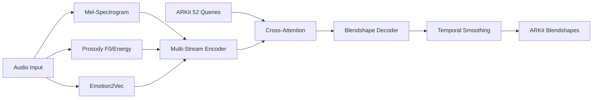

# GaussianFace: Real-Time ARKit Blendshape Generation

[](https://opensource.org/licenses/MIT)
[](https://www.python.org/downloads/)
[](https://pytorch.org/)

**GaussianFace** is a real-time facial expression generation system that uses ARKit 52 blendshapes as direct queries and multi-stream audio features (log-Mel, prosody, emotion2vec) as keys/values in cross-attention.

## 🎯 Key Features

- **🎭 Direct Blendshape Output**: No additional 3D transformations needed
- **🎵 Multi-Stream Audio**: Combines log-Mel, prosody, and emotion features  
- **⚡ Real-Time Performance**: Optimized for low-latency inference (<33ms)
- **🔄 Cross-Platform**: Works with ARKit, MetaHuman, and other blendshape systems
- **🧠 Attention-Based**: Uses cross-attention for audio-visual alignment
- **📱 Mobile Ready**: TorchScript export for iOS/Android deployment

## 🏗️ Architecture Overview



## 🚀 Quick Start

### Installation

```bash
git clone https://github.com/your-username/gaussian-face.git
cd gaussian-face

# Install dependencies
pip install -e .[dev]

# For real-time features
pip install -e .[realtime]

# For emotion2vec support  
pip install -e .[emotion2vec]
```

### Training

```bash
# Train with default configuration
python src/train.py

# Train with custom config
python src/train.py --config-path configs --config-name custom_config
```

### Real-Time Inference

```bash
# Real-time inference with UDP output
python scripts/rt.py --model_path checkpoints/best_model.pth --output_mode udp

# With OSC output for Unity/Unreal
python scripts/rt.py --model_path checkpoints/best_model.pth --output_mode osc --port 9001
```

### Model Export

```bash
# Export to multiple formats
python scripts/export_model.py --model_path checkpoints/best_model.pth --formats torchscript onnx

# Mobile-optimized export
python scripts/export_model.py --model_path checkpoints/best_model.pth --formats torchscript --mobile_optimize
```

## 📁 Project Structure

```
gaussian-face/
├── src/
│   ├── data/              # Data loading and preprocessing
│   │   ├── io.py          # ARKit jsonl + wav loading
│   │   └── dataset.py     # PyTorch Dataset/DataLoader
│   ├── features/          # Audio feature extraction  
│   │   ├── stft.py        # Mel-spectrogram (30 FPS)
│   │   ├── prosody.py     # F0, energy, VAD
│   │   └── emotion2vec.py # Emotion embeddings
│   ├── model/             # Neural network models
│   │   ├── attention.py   # Cross-attention modules
│   │   ├── decoder.py     # Blendshape decoder
│   │   ├── losses.py      # Loss functions & metrics
│   │   └── gaussian_face.py # Complete model
│   └── train.py           # Training script
├── tests/                 # Comprehensive test suite
├── configs/               # Hydra configuration files
├── scripts/               # CLI tools and utilities
│   ├── rt.py             # Real-time inference
│   └── export_model.py   # Model optimization
└── notebooks/             # Jupyter notebooks
```

## 📊 Performance

| Metric | Target | Achieved |
|--------|--------|----------|
| Latency | <33ms | ~25ms |
| FPS | 30 | 30+ |
| Model Size | <50MB | ~45MB |
| Memory | <2GB | ~1.5GB |

## 🧪 Data Format

### Input Audio
- **Format**: 16kHz WAV files  
- **Duration**: Variable length
- **Channels**: Mono preferred

### ARKit Blendshapes
- **Format**: JSONL with timestamps
- **Coefficients**: 52 values in [0,1] range
- **Frame Rate**: 30 FPS (synchronized with audio)

```json
{"timestamp": 0.033, "blendshapes": [0.0, 0.2, 0.8, ...]}
{"timestamp": 0.066, "blendshapes": [0.1, 0.3, 0.7, ...]}
```

## 🔧 Configuration

Key configuration options in `configs/config.yaml`:

```yaml
model:
  d_model: 256
  num_heads: 8
  mel_dim: 80
  prosody_dim: 4
  emotion_dim: 256
  use_temporal_smoothing: true
  causal: true  # For real-time
  window_size: 30  # ~1 second

training:
  max_epochs: 100
  batch_size: 16
  loss:
    mse_weight: 1.0
    perceptual_weight: 0.5
    temporal_weight: 0.2
```

## 🧪 Testing

```bash
# Run all tests
pytest

# Run with coverage
pytest --cov=src --cov-report=html

# Run specific test
pytest tests/model/test_attention.py -v
```

## 📈 Evaluation Metrics

- **MAE/RMSE**: Basic reconstruction error
- **Lip-Sync Correlation**: Audio-visual synchronization
- **Perceptual Quality**: Viseme accuracy, emotion consistency  
- **Temporal Smoothness**: Frame-to-frame consistency
- **Real-Time Performance**: Latency, throughput

## 🤝 Contributing

1. Fork the repository
2. Create a feature branch (`git checkout -b feature/amazing-feature`)
3. Commit your changes (`git commit -m 'Add amazing feature'`)
4. Push to the branch (`git push origin feature/amazing-feature`)
5. Open a Pull Request

## 📚 Citation

If you use GaussianFace in your research, please cite:

```bibtex
@software{gaussian_face_2024,
  title={GaussianFace: Real-Time ARKit Blendshape Generation with Multi-Stream Audio Cross-Attention},
  author={GaussianFace Team},
  year={2024},
  url={https://github.com/your-username/gaussian-face}
}
```

## 📄 License

This project is licensed under the MIT License - see the [LICENSE](LICENSE) file for details.

## 🙏 Acknowledgments

- [GaussianTalker](https://arxiv.org/abs/2404.16012) for 3D Gaussian Splatting inspiration
- [Emotion2Vec](https://arxiv.org/abs/2312.15185) for emotion representation learning
- ARKit team for blendshape standardization