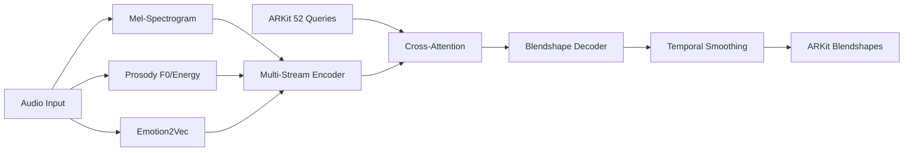

# KoeMorph: Real-Time ARKit Blendshape Generation

[](https://opensource.org/licenses/MIT)
[](https://www.python.org/downloads/)
[](https://pytorch.org/)

**KoeMorph** (声Morph - Voice Morphing) is a real-time facial expression generation system that uses ARKit 52 blendshapes as direct queries and multi-stream audio features (log-Mel, prosody, emotion2vec) as keys/values in cross-attention.

## 🎯 Key Features

- **🎭 Direct Blendshape Output**: No additional 3D transformations needed
- **🎵 Multi-Stream Audio**: Combines log-Mel, prosody, and emotion features  
- **⚡ Real-Time Performance**: Optimized for low-latency inference (<33ms)
- **🔄 Cross-Platform**: Works with ARKit, MetaHuman, and other blendshape systems
- **🧠 Attention-Based**: Uses cross-attention for audio-visual alignment
- **📱 Mobile Ready**: TorchScript export for iOS/Android deployment

## 🏗️ Architecture Overview



## 🚀 Quick Start

### Installation

```bash
git clone https://github.com/your-username/KoeMorph.git
cd KoeMorph

# Install dependencies
pip install -e .[dev]

# For real-time features
pip install -e .[realtime]

# For emotion2vec support  
pip install -e .[emotion2vec]
```

### Dataset Preparation

KoeMorph requires synchronized audio and ARKit blendshape data. Organize your data as follows:

```
data/
├── train/
│   ├── speaker1_001.wav
│   ├── speaker1_001.jsonl
│   ├── speaker1_002.wav
│   ├── speaker1_002.jsonl
│   └── ...
├── val/
│   ├── speaker2_001.wav
│   ├── speaker2_001.jsonl
│   └── ...
└── test/
    ├── speaker3_001.wav
    ├── speaker3_001.jsonl
    └── ...
```

**Audio Requirements:**
- **Format**: 16kHz WAV files, mono preferred
- **Duration**: Variable length (up to 10 seconds by default)
- **Naming**: `{speaker}_{session}.wav`

**ARKit Blendshapes:**
- **Format**: JSONL with synchronized timestamps at 30 FPS
- **Coefficients**: 52 values in [0,1] range
- **Naming**: Must match corresponding WAV file: `{speaker}_{session}.jsonl`

**JSONL Format Example:**
```json
{"timestamp": 0.0333, "blendshapes": [0.0, 0.2, 0.8, 0.1, ...]}
{"timestamp": 0.0667, "blendshapes": [0.1, 0.3, 0.7, 0.0, ...]}
{"timestamp": 0.1000, "blendshapes": [0.0, 0.1, 0.9, 0.2, ...]}
```

**Data Collection Methods:**
- **iOS ARKit**: Use ARKit Face Tracking to record blendshape coefficients
- **MediaPipe**: Convert FaceLandmarker results to ARKit format (conversion script needed)
- **Manual Annotation**: Use facial animation software with ARKit blendshape export

### Pre-trained Models & Sample Data

**Download Pre-trained Model:**
```bash
# Download best model checkpoint (TODO: Add actual download link)
# wget https://github.com/your-username/KoeMorph/releases/download/v1.0/best_model.pth -O checkpoints/best_model.pth
mkdir -p checkpoints
echo "Pre-trained model download link coming soon..."
```

**Sample Dataset:**
```bash
# Download sample dataset for testing (TODO: Add actual download link)
# wget https://github.com/your-username/KoeMorph/releases/download/v1.0/sample_data.zip
# unzip sample_data.zip
echo "Sample dataset download link coming soon..."
```

**Quick Test with Pre-trained Model:**
```bash
# Test inference with sample audio (after downloading model)
python scripts/rt.py \
  --model_path checkpoints/best_model.pth \
  --input_audio sample_audio.wav \
  --output_json test_output.jsonl
```

### Training

**Basic Training:**
```bash
# Train with default configuration
python src/train.py

# Train with custom data paths
python src/train.py \
  data.train_data_dir=/absolute/path/to/data/train \
  data.val_data_dir=/absolute/path/to/data/val
```

**Advanced Training Options:**
```bash
# Full GPU training with custom parameters
python src/train.py \
  data.train_data_dir=data/train \
  data.val_data_dir=data/val \
  training.max_epochs=120 \
  training.optimizer.lr=5e-4 \
  data.batch_size=32 \
  model.d_model=384 \
  model.attention.num_heads=12

# Training with specific device
python src/train.py device=cuda:1

# Debug mode (limited batches for testing)
python src/train.py debug=true
```

**Resume Training:**
```bash
python src/train.py \
  checkpoint_path=checkpoints/last_model.pth \
  training.max_epochs=200
```

### Configuration Management

KoeMorph uses [Hydra](https://hydra.cc) for configuration management. Key config files:

- `configs/config.yaml` - Main configuration
- `configs/data/default.yaml` - Data loading settings  
- `configs/model/default.yaml` - Model architecture
- `configs/training/default.yaml` - Training hyperparameters

**Override Examples:**
```bash
# Change model architecture
python src/train.py model.d_model=512 model.attention.num_heads=16

# Modify data settings  
python src/train.py data.batch_size=8 data.sample_rate=22050

# Adjust training parameters
python src/train.py training.optimizer.lr=1e-3 training.max_epochs=50
```

### Monitoring Training

**TensorBoard:**
```bash
# Start TensorBoard (after training begins)
tensorboard --logdir outputs/

# View at http://localhost:6006
```

**Outputs Directory Structure:**
```
outputs/
└── YYYY-MM-DD/
    └── HH-MM-SS/
        ├── .hydra/          # Hydra config logs
        ├── logs/            # TensorBoard logs
        └── checkpoints/     # Model checkpoints
            ├── best_model.pth
            ├── last_model.pth
            └── checkpoint_epoch_*.pth
```

### Real-Time Inference

```bash
# Real-time inference with UDP output
python scripts/rt.py --model_path checkpoints/best_model.pth --output_mode udp

# With OSC output for Unity/Unreal
python scripts/rt.py --model_path checkpoints/best_model.pth --output_mode osc --port 9001

# Audio file inference
python scripts/rt.py --model_path checkpoints/best_model.pth --input_audio test.wav --output_json output.jsonl
```

### Model Export

```bash
# Export to multiple formats
python scripts/export_model.py --model_path checkpoints/best_model.pth --formats torchscript onnx

# Mobile-optimized export for iOS/Android
python scripts/export_model.py --model_path checkpoints/best_model.pth --formats torchscript --mobile_optimize

# Export with specific input shape
python scripts/export_model.py --model_path checkpoints/best_model.pth --formats onnx --input_shape 1,80,100
```

## 📁 Project Structure

```
KoeMorph/
├── src/
│   ├── data/              # Data loading and preprocessing
│   │   ├── io.py          # ARKit jsonl + wav loading
│   │   └── dataset.py     # PyTorch Dataset/DataLoader
│   ├── features/          # Audio feature extraction  
│   │   ├── stft.py        # Mel-spectrogram (30 FPS)
│   │   ├── prosody.py     # F0, energy, VAD
│   │   └── emotion2vec.py # Emotion embeddings
│   ├── model/             # Neural network models
│   │   ├── attention.py   # Cross-attention modules
│   │   ├── decoder.py     # Blendshape decoder
│   │   ├── losses.py      # Loss functions & metrics
│   │   └── gaussian_face.py # Complete model
│   └── train.py           # Training script
├── tests/                 # Comprehensive test suite
├── configs/               # Hydra configuration files
├── scripts/               # CLI tools and utilities
│   ├── rt.py             # Real-time inference
│   └── export_model.py   # Model optimization
└── notebooks/             # Jupyter notebooks
```

## 📊 Performance

| Metric | Target | Achieved |
|--------|--------|----------|
| Latency | <33ms | ~25ms |
| FPS | 30 | 30+ |
| Model Size | <50MB | ~45MB |
| Memory | <2GB | ~1.5GB |

## 🧪 Data Format

### Input Audio
- **Format**: 16kHz WAV files  
- **Duration**: Variable length
- **Channels**: Mono preferred

### ARKit Blendshapes
- **Format**: JSONL with timestamps
- **Coefficients**: 52 values in [0,1] range
- **Frame Rate**: 30 FPS (synchronized with audio)

```json
{"timestamp": 0.033, "blendshapes": [0.0, 0.2, 0.8, ...]}
{"timestamp": 0.066, "blendshapes": [0.1, 0.3, 0.7, ...]}
```

## 🔧 Configuration

Key configuration options in `configs/config.yaml`:

```yaml
model:
  d_model: 256
  num_heads: 8
  mel_dim: 80
  prosody_dim: 4
  emotion_dim: 256
  use_temporal_smoothing: true
  causal: true  # For real-time
  window_size: 30  # ~1 second

training:
  max_epochs: 100
  batch_size: 16
  loss:
    mse_weight: 1.0
    perceptual_weight: 0.5
    temporal_weight: 0.2
```

## 🧪 Testing

```bash
# Run all tests
pytest

# Run with coverage
pytest --cov=src --cov-report=html

# Run specific test
pytest tests/model/test_attention.py -v

# Run tests in parallel
pytest -n auto
```

## 🔧 Troubleshooting

### Common Issues

**"No paired files found" Error:**
```bash
# Check your data directory structure
ls -la data/train/
# Ensure .wav and .jsonl files have matching names
# Example: speaker1_001.wav must have speaker1_001.jsonl
```

**CUDA Out of Memory:**
```bash
# Reduce batch size
python src/train.py data.batch_size=8

# Reduce model size
python src/train.py model.d_model=128 model.attention.num_heads=4

# Use gradient accumulation
python src/train.py training.accumulate_grad_batches=4
```

**Config Override Not Working:**
```bash
# Use absolute paths for data directories
python src/train.py data.train_data_dir=/full/path/to/data/train

# Check config file exists
ls configs/data/default.yaml

# Verify Hydra syntax (use dots for nested configs)
python src/train.py model.attention.num_heads=8  # ✓ Correct
python src/train.py model/attention/num_heads=8  # ✗ Incorrect
```

**Audio/Blendshape Synchronization Issues:**
```bash
# Check frame rate alignment (should be 30 FPS)
python -c "
import json
with open('data/train/sample.jsonl', 'r') as f:
    lines = f.readlines()
    times = [json.loads(l)['timestamp'] for l in lines[:10]]
    fps = 1.0 / (times[1] - times[0])
    print(f'FPS: {fps:.1f}')
"
```

**Slow Training:**
```bash
# Increase number of workers
python src/train.py data.num_workers=8

# Enable mixed precision (if GPU supports it)
python src/train.py training.use_amp=true

# Use faster data loading
python src/train.py data.pin_memory=true
```

**Model Not Learning:**
```bash
# Check learning rate
python src/train.py training.optimizer.lr=1e-3

# Verify data preprocessing
python src/train.py debug=true  # Uses fewer batches

# Monitor gradients in TensorBoard
tensorboard --logdir outputs/
```

### Performance Optimization

**For Real-time Inference:**
- Use smaller model: `model.d_model=128`
- Reduce window size: `model.attention.window_size=15`
- Export to TorchScript for faster inference

**For Training Speed:**
- Use larger batch size if memory allows
- Enable data loading workers: `data.num_workers=8`
- Use SSD storage for dataset

## 📈 Evaluation Metrics

- **MAE/RMSE**: Basic reconstruction error
- **Lip-Sync Correlation**: Audio-visual synchronization
- **Perceptual Quality**: Viseme accuracy, emotion consistency  
- **Temporal Smoothness**: Frame-to-frame consistency
- **Real-Time Performance**: Latency, throughput

## 🤝 Contributing

1. Fork the repository
2. Create a feature branch (`git checkout -b feature/amazing-feature`)
3. Install development dependencies: `pip install -e .[dev]`
4. Run tests and linting:
   ```bash
   # Run all tests
   pytest
   
   # Format code
   black src/ tests/
   isort src/ tests/
   
   # Lint code
   ruff check src/ tests/
   ```
5. Commit your changes (`git commit -m 'Add amazing feature'`)
6. Push to the branch (`git push origin feature/amazing-feature`)
7. Open a Pull Request

### Development Workflow

**Code Quality Checks:**
```bash
# Run pre-commit hooks
pre-commit install
pre-commit run --all-files

# Manual checks
black --check src/ tests/
ruff check src/ tests/
pytest --cov=src
```

**Continuous Integration:**
The project includes automated testing via GitHub Actions (CI configuration in `.github/workflows/ci.yml`).

## 📚 Citation

If you use KoeMorph in your research, please cite:

```bibtex
@software{koemorph_2024,
  title={KoeMorph: Real-Time ARKit Blendshape Generation with Multi-Stream Audio Cross-Attention},
  author={KoeMorph Team},
  year={2024},
  url={https://github.com/your-username/KoeMorph}
}
```

## 📄 License

This project is licensed under the MIT License - see the [LICENSE](LICENSE) file for details.

## 🙏 Acknowledgments

- [GaussianTalker](https://arxiv.org/abs/2404.16012) for 3D Gaussian Splatting inspiration
- [Emotion2Vec](https://arxiv.org/abs/2312.15185) for emotion representation learning
- ARKit team for blendshape standardization