# KoeMorph: Real-Time ARKit Blendshape Generation

[](https://opensource.org/licenses/MIT)
[](https://www.python.org/downloads/)
[](https://pytorch.org/)

**English** | [日本語 (Japanese)](README.ja.md)

**KoeMorph** (声Morph - Voice Morphing) is a real-time facial expression generation system that uses ARKit 52 blendshapes as direct queries and dual-stream audio features (Mel-spectrogram + OpenSMILE eGeMAPS) as keys/values in cross-attention with temporal continuity.

## 🎯 Key Features

- **🎭 Direct Blendshape Output**: No additional 3D transformations needed
- **🎵 Enhanced Dual-Stream Architecture**: Separates Mel-spectrogram (mouth + temporal detail) and eGeMAPS (expression + temporal diversity) processing
- **⚡ Real-Time Performance**: <0.1 RTF with temporal smoothing (<33ms latency)
- **🔄 Cross-Platform**: Works with ARKit, MetaHuman, and other blendshape systems
- **🎬 Multi Frame Rate Support**: Native 30fps and 60fps with automatic resampling
- **🧠 Natural Specialization**: Self-learning mouth vs expression role assignment with optimized information balance (80.9:1 ratio)
- **🎯 Sequential Training**: Full time-series output with configurable stride
- **🔊 Enhanced Mouth Precision**: Temporal concatenation (3-frame detail) for superior viseme accuracy
- **📊 Information Balance**: 2.9x improved information density ratio for optimal learning
- **🚀 Efficient Sequential Processing**: Single emotion extraction for entire sequence
- **📱 Mobile Ready**: TorchScript export for iOS/Android deployment

## 🏗️ Architecture Overview

```mermaid
graph LR
    A[Audio Input<br/>8.5s Context] --> B[Enhanced Mel Processing<br/>256×80 + 3×80 = 20,720D]
    A --> C[Enhanced eGeMAPS<br/>3-Window Concatenation<br/>264D → 256D]
    
    B --> D[Enhanced Mel Encoder<br/>Long-term + Short-term]
    C --> E[Enhanced Emotion Encoder<br/>Temporal diversity features]
    
    F[ARKit 52 Queries] --> G[Enhanced Dual-Stream Attention<br/>80.9:1 Information Balance]
    D --> G
    E --> G
    
    G --> H[Blendshape Decoder]
    H --> I[Temporal Smoothing<br/>Learnable α]
    I --> J[ARKit Blendshapes<br/>30/60 FPS + Enhanced Precision]
```



## 🚀 Quick Start

### Installation

```bash
git clone https://github.com/atsuki-ichikawa/KoeMorph.git
cd KoeMorph

# Install dependencies
pip install -e .[dev]

# For real-time features
pip install -e .[realtime]

# For OpenSMILE eGeMAPS support  
pip install -e .[opensmile]
```

### Dataset Preparation

KoeMorph supports two data formats. **v2.0 folder-based format is recommended** for new projects:

#### KoeMorph v2.0 Format (Recommended)

Each recording is organized in a folder with standardized filenames:

```
data/
├── processed/
│   ├── MySlate_001_iPhone_14/
│   │   ├── audio.wav              # 16kHz audio
│   │   ├── blendshapes.jsonl      # ARKit blendshapes (30fps or 60fps)
│   │   ├── metadata.json          # Processing metadata
│   │   └── timecode.json          # SMPTE timecode sync (optional)
│   ├── MySlate_002_iPhone_14/
│   │   ├── audio.wav
│   │   ├── blendshapes.jsonl
│   │   ├── metadata.json
│   │   └── timecode.json
│   └── ...
```

**Enhanced JSONL Format (v2.0):**
```json
{"frame_index": 0, "timestamp": 0.0000, "timecode": "00:00:00:00", "blendshapes": [0.0, 0.2, 0.8, ...]}
{"frame_index": 1, "timestamp": 0.0167, "timecode": "00:00:00:01", "blendshapes": [0.1, 0.3, 0.7, ...]}
{"frame_index": 2, "timestamp": 0.0333, "timecode": "00:00:00:02", "blendshapes": [0.0, 0.1, 0.9, ...]}
```

**Metadata Format:**
```json
{
  "source_fps": 60.0,
  "duration_seconds": 15.23,
  "num_frames": 914,
  "processing_date": "2024-07-30T21:30:00Z",
  "source_format": "ARKit_iPhone_14"
}
```

#### Legacy Format (v1.0)

Traditional file-pair format for existing datasets:

```
data/
├── train/
│   ├── speaker1_001.wav
│   ├── speaker1_001.jsonl
│   └── ...
├── val/
│   └── ...
└── test/
    └── ...
```

**Audio Requirements:**
- **Format**: 16kHz WAV files, mono preferred
- **Duration**: Variable length (minimum 8.5 seconds for full context)
- **Frame Rate**: 30fps and 60fps both supported with automatic resampling

**Data Collection Methods:**
- **iOS ARKit**: Use ARKit Face Tracking to record blendshape coefficients
- **MediaPipe**: Convert FaceLandmarker results to ARKit format (conversion script needed)
- **Manual Annotation**: Use facial animation software with ARKit blendshape export

### Pre-trained Models & Sample Data

**Download Pre-trained Model:**
```bash
# Download best model checkpoint (TODO: Add actual download link)
# wget https://github.com/your-username/KoeMorph/releases/download/v1.0/best_model.pth -O checkpoints/best_model.pth
mkdir -p checkpoints
echo "Pre-trained model download link coming soon..."
```

**Sample Dataset:**
```bash
# Download sample dataset for testing (TODO: Add actual download link)
# wget https://github.com/your-username/KoeMorph/releases/download/v1.0/sample_data.zip
# unzip sample_data.zip
echo "Sample dataset download link coming soon..."
```

**Quick Test with Pre-trained Model:**
```bash
# Test inference with sample audio (after downloading model)
python scripts/rt.py \
  --model_path checkpoints/best_model.pth \
  --input_audio sample_audio.wav \
  --output_json test_output.jsonl
```

### Training

**Sequential Training (Recommended):**
```bash
# Train with v2.0 data format (default OpenSMILE backend)
PYTHONPATH=/path/to/KoeMorph python src/train_sequential.py data=koemorph_v2

# Train with specific data directory
PYTHONPATH=/path/to/KoeMorph python src/train_sequential.py \
  data=koemorph_v2 \
  data.train_data_dir=/absolute/path/to/your/data/processed

# Train with legacy data format (v1.0)
PYTHONPATH=/path/to/KoeMorph python src/train_sequential.py

# Train with emotion2vec backend (requires FunASR installation)
PYTHONPATH=/path/to/KoeMorph python src/train_sequential.py \
  data=koemorph_v2 \
  model.emotion_config.backend=emotion2vec
```

**Advanced Sequential Training:**
```bash
# Full GPU training with dual-stream optimization
python src/train_sequential.py \
  data.train_data_dir=data/train \
  data.val_data_dir=data/val \
  training.max_epochs=100 \
  training.optimizer.lr=3e-4 \
  data.batch_size=4 \
  model.d_model=256 \
  model.dual_stream_attention.temperature=0.1

# Dense sampling for high-quality training
python src/train_sequential.py \
  data.stride_mode=dense \
  data.window_frames=256 \
  data.stride_frames=1

# Mixed sampling for efficiency
python src/train_sequential.py \
  data.stride_mode=mixed \
  data.dense_sampling_ratio=0.1

# Debug mode (limited files and batches)
python src/train_sequential.py debug=true data.max_files=5
```

**Legacy Training (Non-Sequential):**
```bash
# For comparison with sequential version
python src/train.py
```

**Resume Training:**
```bash
# Resume sequential training
python src/train_sequential.py \
  checkpoint_path=checkpoints/last_model.pth \
  training.max_epochs=150

# Resume with different stride strategy
python src/train_sequential.py \
  checkpoint_path=checkpoints/last_model.pth \
  data.stride_mode=dense \
  training.max_epochs=120
```

### Configuration Management

KoeMorph uses [Hydra](https://hydra.cc) for configuration management. Key config files:

- `configs/config.yaml` - Main configuration with defaults
- `configs/data/koemorph_v2.yaml` - **New v2.0 data format (recommended)**
- `configs/data/default.yaml` - Legacy data loading settings  
- `configs/model/default.yaml` - Model architecture settings
- `configs/training/default.yaml` - Training hyperparameters

**Override Examples:**
```bash
# Change dual-stream model architecture
python src/train_sequential.py \
  model.d_model=512 \
  model.dual_stream_attention.temperature=0.05

# Modify sequential data settings  
python src/train_sequential.py \
  data.batch_size=8 \
  data.window_frames=128 \
  data.stride_mode=progressive

# Adjust training parameters
python src/train_sequential.py \
  training.optimizer.lr=5e-4 \
  training.max_epochs=120 \
  loss.temporal_weight=0.3
```

### Monitoring Training

**TensorBoard:**
```bash
# Start TensorBoard (after training begins)
tensorboard --logdir outputs/

# View at http://localhost:6006
```

**Outputs Directory Structure:**
```
outputs/
└── YYYY-MM-DD/
    └── HH-MM-SS/
        ├── .hydra/          # Hydra config logs
        ├── logs/            # TensorBoard logs
        └── checkpoints/     # Model checkpoints
            ├── best_model.pth
            ├── last_model.pth
            └── checkpoint_epoch_*.pth
```

### Real-Time Inference

```bash
# Real-time inference with UDP output
python scripts/rt.py --model_path checkpoints/best_model.pth --output_mode udp

# With OSC output for Unity/Unreal
python scripts/rt.py --model_path checkpoints/best_model.pth --output_mode osc --port 9001

# Audio file inference
python scripts/rt.py --model_path checkpoints/best_model.pth --input_audio test.wav --output_json output.jsonl
```

### Model Export

```bash
# Export to multiple formats
python scripts/export_model.py --model_path checkpoints/best_model.pth --formats torchscript onnx

# Mobile-optimized export for iOS/Android
python scripts/export_model.py --model_path checkpoints/best_model.pth --formats torchscript --mobile_optimize

# Export with specific input shape
python scripts/export_model.py --model_path checkpoints/best_model.pth --formats onnx --input_shape 1,80,100
```

## 📁 Project Structure

```
KoeMorph/
├── src/
│   ├── data/                          # Data loading and preprocessing
│   │   ├── io.py                      # ARKit jsonl + wav loading
│   │   ├── koemorph_dataset.py        # **KoeMorph v2.0 dataset classes**
│   │   ├── sequential_dataset.py      # Sequential time-series dataset
│   │   └── adaptive_sequential_dataset.py # Adaptive stride strategies
│   ├── features/                      # Audio feature extraction  
│   │   ├── mel_sliding_window.py      # Mel-spectrogram sliding window (256×80, 33.3ms)
│   │   ├── opensmile_extractor.py     # **Enhanced OpenSMILE eGeMAPS with concatenation**
│   │   └── emotion_extractor.py       # **Enhanced emotion extraction with OpenSMILE backend**
│   ├── model/                         # Neural network models
│   │   ├── dual_stream_attention.py   # **Enhanced dual-stream cross-attention**
│   │   ├── sequential_dual_stream_model.py # **Sequential model for full time-series output**
│   │   ├── simplified_dual_stream_model.py # Complete dual-stream model
│   │   ├── attention.py               # Legacy cross-attention modules
│   │   ├── decoder.py                 # Blendshape decoder
│   │   ├── losses.py                  # Loss functions & metrics
│   │   └── gaussian_face.py           # Legacy complete model
│   ├── train_sequential.py            # **Enhanced sequential training script**
│   └── train.py                       # Legacy training script
├── tests/                             # Comprehensive test suite
├── configs/                           # Hydra configuration files
│   ├── dual_stream_config.yaml        # Dual-stream sequential training
│   └── model/dual_stream.yaml         # Dual-stream model architecture
├── scripts/                           # CLI tools and utilities
│   ├── rt.py                         # Real-time inference
│   └── export_model.py               # Model optimization
├── docs/training_process/             # Detailed training documentation
└── notebooks/                         # Jupyter notebooks
```

## 📊 Performance

| Metric | Target | Standard | Enhanced | 60fps Mode |
|--------|--------|----------|----------|------------|
| **Real-Time Factor (RTF)** | <0.1 | ~0.06 | ~0.06 | ~0.08 |
| **Latency** | <33ms | ~20ms | ~20ms | ~16.7ms |
| **FPS** | 30/60 | 30+ | 30+ | 60+ |
| **Model Size** | <10MB | ~8MB | ~8.2MB | ~8.2MB |
| **Memory (Inference)** | <500MB | ~350MB | ~355MB | ~450MB |
| **Memory (Training)** | <4GB | ~2.5GB | ~2.6GB | ~3.2GB |
| **Information Balance** | <100:1 | 232:1 | **80.9:1** ✨ | **80.9:1** ✨ |
| **Viseme Accuracy** | High | Good | **Superior** ✨ | **Superior** ✨ |
| **Sequential Output** | Yes | No | No | **Yes** ✨ |

### Enhanced Performance Breakdown
- **Enhanced Mel Extraction RTF**: ~0.03 (1.2% overhead for 20,720D processing)
- **Enhanced Emotion Extraction RTF**: ~0.01 (3-window concatenation + compression)
- **Enhanced Model Inference RTF**: ~0.02 (optimized attention with balanced information)
- **Total Enhanced System RTF**: <0.1 (production ready with superior quality)

## 🧪 Data Format

### Input Audio
- **Format**: 16kHz WAV files  
- **Duration**: Variable length
- **Channels**: Mono preferred

### ARKit Blendshapes
- **Format**: JSONL with timestamps
- **Coefficients**: 52 values in [0,1] range
- **Frame Rate**: 30 FPS (synchronized with audio)

```json
{"timestamp": 0.033, "blendshapes": [0.0, 0.2, 0.8, ...]}
{"timestamp": 0.066, "blendshapes": [0.1, 0.3, 0.7, ...]}
```

## 🔧 Configuration

Key configuration options in `configs/data/koemorph_v2.yaml`:

```yaml
# KoeMorph v2.0 Data Configuration
_target_: src.data.koemorph_dataset.KoeMorphDataModule

# Data paths (v2.0 folder-based format)
train_data_dir: "/path/to/koemorph_learning_data/data/processed"
target_fps: 60  # Auto-detected from metadata, supports 30fps and 60fps

# Sequential dataset settings
sequential:
  window_frames: 512  # ~8.5 seconds at 60fps
  stride_frames: 256  # 50% overlap for training

# Enhanced emotion configuration
emotion_config:
  backend: opensmile  # opensmile (recommended) or emotion2vec
  use_concatenation: true  # 3-window concatenation approach
  window_intervals: [0.0, 0.3, 0.6]  # current, -300ms, -600ms
  context_window: 20.0  # seconds per window
  update_interval: 0.3  # 300ms update interval

# Training settings
batch_size: 16  # Adjusted for new data format
num_workers: 4
pin_memory: true

# Metadata handling
metadata:
  use_timecode: true  # Use SMPTE timecode if available
  verify_sync: true   # Verify audio-blendshape synchronization
  auto_detect_fps: true  # Automatically detect source FPS
```

**Model Configuration (configs/model/default.yaml):**
```yaml
# Enhanced dual-stream model
d_model: 256
attention:
  num_heads: 8
  emotion_dim: 256  # Matches OpenSMILE concatenated output
  
# Emotion processing settings (passed to EmotionExtractor)
emotion_config:
  backend: opensmile
  use_concatenation: true
  context_window: 20.0
  update_interval: 0.3
```

## 🧪 Testing

```bash
# Run all tests
pytest

# Run with coverage
pytest --cov=src --cov-report=html

# Run specific test
pytest tests/model/test_attention.py -v

# Run tests in parallel
pytest -n auto
```

## 🔧 Troubleshooting

### Common Issues

**"No paired files found" Error:**
```bash
# Check your data directory structure
ls -la data/train/
# Ensure .wav and .jsonl files have matching names
# Example: speaker1_001.wav must have speaker1_001.jsonl
```

**CUDA Out of Memory:**
```bash
# Reduce batch size (already small for sequential)
python src/train_sequential.py data.batch_size=2

# Reduce model size
python src/train_sequential.py model.d_model=128

# Reduce context window
python src/train_sequential.py data.window_frames=128

# Use gradient accumulation
python src/train_sequential.py training.accumulate_grad_batches=4
```

**Config Override Not Working:**
```bash
# Set PYTHONPATH correctly
export PYTHONPATH=/path/to/KoeMorph
python src/train_sequential.py data=koemorph_v2

# Use absolute paths for data directories
PYTHONPATH=/path/to/KoeMorph python src/train_sequential.py \
  data=koemorph_v2 \
  data.train_data_dir=/full/path/to/data/processed

# Check config files exist
ls configs/data/koemorph_v2.yaml
ls configs/model/default.yaml

# Verify Hydra syntax (use dots for nested configs)
PYTHONPATH=/path/to/KoeMorph python src/train_sequential.py \
  data=koemorph_v2 \
  model.emotion_config.backend=opensmile  # ✓ Correct
```

**Audio/Blendshape Synchronization Issues:**
```bash
# Check frame rate alignment (should be 30 FPS)
python -c "
import json
with open('data/train/sample.jsonl', 'r') as f:
    lines = f.readlines()
    times = [json.loads(l)['timestamp'] for l in lines[:10]]
    fps = 1.0 / (times[1] - times[0])
    print(f'FPS: {fps:.1f}')
"
```

**Slow Training:**
```bash
# Use sparse sampling for faster training
python src/train_sequential.py data.stride_mode=sparse data.initial_stride=16

# Increase number of workers (limited for sequential)
python src/train_sequential.py data.num_workers=2

# Use progressive mode for efficient learning
python src/train_sequential.py data.stride_mode=progressive

# Use faster data loading
python src/train_sequential.py data.pin_memory=true
```

**Model Not Learning:**
```bash
# Check learning rate (lower for sequential)
python src/train_sequential.py training.optimizer.lr=5e-4

# Verify sequential data preprocessing
python src/train_sequential.py debug=true data.max_files=3

# Monitor temporal smoothing and stream specialization
tensorboard --logdir outputs/

# Check stride settings aren't too sparse
python src/train_sequential.py data.stride_mode=mixed data.dense_sampling_ratio=0.2
```

### Performance Optimization

**For Real-time Inference:**
- Use smaller model: `model.d_model=128`
- Reduce context window: `data.window_frames=128` (4.3s context)
- Use sparse emotion updates: `features.emotion.update_interval=0.5`
- Export to TorchScript for faster inference

**For Training Speed:**
- Use progressive stride: `data.stride_mode=progressive`
- Start with sparse sampling: `data.initial_stride=32` 
- Use mixed sampling for balance: `data.stride_mode=mixed data.dense_sampling_ratio=0.1`
- Enable data loading workers: `data.num_workers=2` (limited for sequential)
- Use SSD storage for dataset

**For Training Quality:**
- End with dense sampling: `data.final_stride=1`
- Increase temporal weight: `loss.temporal_weight=0.3`
- Use longer emotion context: `features.emotion.context_window=30.0`

## 📈 Evaluation Metrics

### Enhanced Sequential Training Metrics
- **Stride-aware MAE**: Weighted error across different sampling densities
- **File-wise Consistency**: Frame-to-frame variation within files
- **Enhanced Stream Specialization**: Mouth vs expression accuracy with 80.9:1 information balance
- **Temporal Smoothing**: Effectiveness of learnable α parameter
- **Viseme Accuracy**: Short-term temporal detail effectiveness for mouth precision
- **Information Density Balance**: Mel-to-emotion feature ratio optimization
- **Real-Time Factor (RTF)**: System performance relative to real-time

### Traditional Metrics
- **MAE/RMSE**: Basic reconstruction error
- **Correlation**: Per-blendshape prediction accuracy
- **Perceptual Quality**: Viseme accuracy, emotion consistency  
- **Temporal Continuity**: Frame-to-frame smoothness

## 🤝 Contributing

1. Fork the repository
2. Create a feature branch (`git checkout -b feature/amazing-feature`)
3. Install development dependencies: `pip install -e .[dev]`
4. Run tests and linting:
   ```bash
   # Run all tests
   pytest
   
   # Format code
   black src/ tests/
   isort src/ tests/
   
   # Lint code
   ruff check src/ tests/
   ```
5. Commit your changes (`git commit -m 'Add amazing feature'`)
6. Push to the branch (`git push origin feature/amazing-feature`)
7. Open a Pull Request

### Development Workflow

**Code Quality Checks:**
```bash
# Run pre-commit hooks
pre-commit install
pre-commit run --all-files

# Manual checks
black --check src/ tests/
ruff check src/ tests/
pytest --cov=src
```

**Continuous Integration:**
The project includes automated testing via GitHub Actions (CI configuration in `.github/workflows/ci.yml`).

## 📚 Citation

If you use KoeMorph in your research, please cite:

```bibtex
@software{koemorph_2024,
  title={KoeMorph: Real-Time ARKit Blendshape Generation with Multi-Stream Audio Cross-Attention},
  author={KoeMorph Team},
  year={2024},
  url={https://github.com/your-username/KoeMorph}
}
```

## 📄 License

This project is licensed under the MIT License - see the [LICENSE](LICENSE) file for details.

## 🙏 Acknowledgments

- [GaussianTalker](https://arxiv.org/abs/2404.16012) for 3D Gaussian Splatting inspiration
- [OpenSMILE](https://www.audeering.com/research/opensmile/) for robust prosodic feature extraction
- [Emotion2Vec](https://arxiv.org/abs/2312.15185) for emotion representation learning
- ARKit team for blendshape standardization
- PyTorch community for deep learning framework
